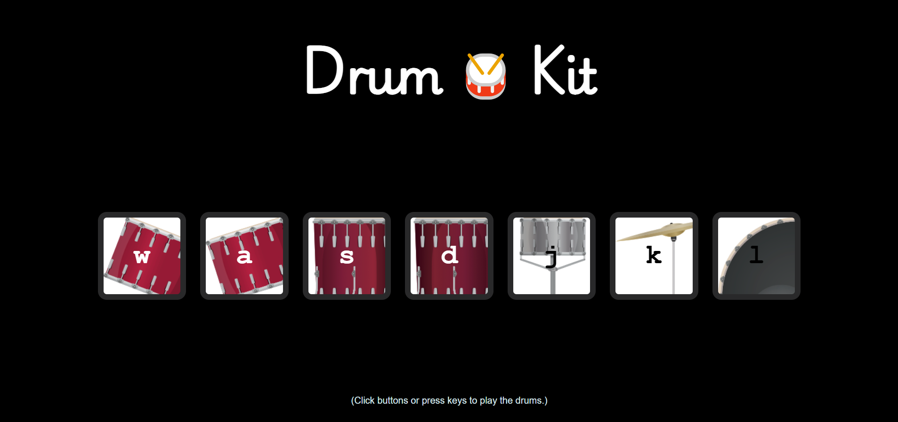

# Drum Kit

This project is a part of my learning journey through Angela Yu's Web Development course. It demonstrates my understanding of DOM manipulation in JavaScript by creating a simple and interactive drum kit. 

## Table of Contents

- [Overview](#overview)
  - [Features](#features)
  - [Screenshots](#screenshots)
  - [Demo](#demo)
- [Usage](#usage)
- [Technologies Used](#technologies-used)
- [What I Learned](#what-i-learned)
- [Credits](#credits)

## Overview

### Features

- Play drum sounds by clicking buttons or pressing corresponding keys.
- Visually highlight the pressed button.
- Responsive design to fit different screen sizes.

### Screenshots

### Demo

You can try the live demo [here](https://akansha82.github.io/drum-kit/).

## Usage

- Click on the drum buttons or press the keys ('w', 'a', 's', 'd', 'j', 'k', 'l') on your keyboard to play the corresponding drum sounds.

## Technologies Used

- HTML
- CSS
- JavaScript

## What I Learned

- **DOM Manipulation**: 
  - Using `document.querySelector` and `document.querySelectorAll` to select elements.
  - Adding event listeners to elements to handle user interactions.
  - Changing element styles dynamically using JavaScript.
  - Playing audio using the `Audio` object in JavaScript.

- **CSS**:
  - Styling elements to make the drum kit visually appealing.
  - Using properties like `background-image`, `box-shadow`, and `border-radius` to enhance the UI.

## Credits

- This project was inspired by [Angela Yu's Web Development course](https://www.udemy.com/course/the-complete-web-development-bootcamp/) on Udemy.

